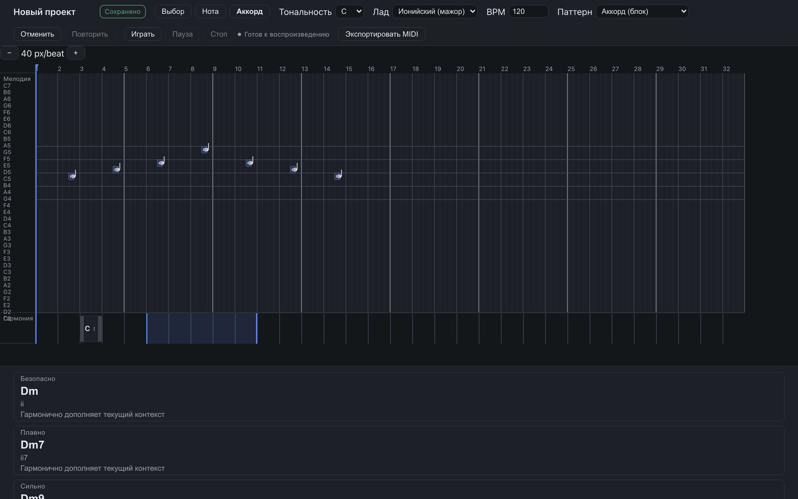
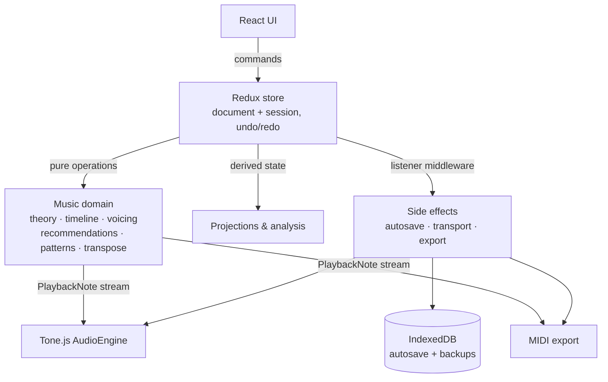

# Harmony

A local-first, browser-based harmonic composition editor. Write a melody, lay down chords, and let the app handle the music theory — roman numerals, voice leading, and next-chord suggestions are computed live from a semantic project model, then rendered to speakers and a MIDI file through one shared pipeline.




*A melody drawn on the staff; the opening chord applied from a suggestion; the panel proposing what comes next — with reasons.*

## Why it looks like this

Harmony is deliberately **not** a miniature DAW or a score engraver. The source of truth is a semantic document — melody notes, chord identities, tonal context, patterns — and everything you *see or hear* is derived from it by pure functions:

- **Chord identity ≠ voicing.** `Cmaj9` is stored as a musical object; the concrete `C3–E3–G3–B3–D4` you hear is computed by a voice-leading engine.
- **Patterns are non-destructive.** An arpeggio exists only in playback and MIDI until you explicitly commit it to notes.
- **One event pipeline.** Playback and MIDI export consume the same rendered `PlaybackNote` stream, so the file always matches what you heard.
- **Suggestions are rule-based and explainable.** No ML: deterministic scoring with human-readable reasons.

## A 60-second tour

1. **Create a project** — pick a tonic, one of 7 diatonic modes, and a length.
2. **Draw a melody** with the note tool: click staff rows to place notes on the diatonic grid (1/16 resolution); in-key spelling is automatic, `Alt + ↑/↓` nudges by semitone for chromatic color.
3. **Drag a range on the harmony lane** — the suggestion panel scores candidate chords on harmonic function, voice leading, melodic fit, and repetition: *safe / smooth / strong / color*, each with reasons.
4. **Click a card to apply.** The chord block appears with its roman numeral; the voicing engine has already picked the nearest voicing to what came before.
5. **`Space` to play**, **Export MIDI** for a two-track file (melody + resolved harmony, PPQ 960).
6. Walk away — every mutation is undoable and autosaved to IndexedDB (watch the save badge).

## Features

**Composition**

- Staff-like melody lane: click to place, drag to move, resize to change duration
- Harmony lane with chord blocks showing symbol + computed roman numeral
- 7 diatonic modes (Ionian through Locrian), global BPM, 4/4, up to 128 bars
- Whole-project transposition (atomic) and mode switching that reanalyzes without moving pitches

**Theory, live**

- Per-note highlighting: chord tones, scale tones, tensions, chromatic notes — recomputed as a long note crosses chord boundaries
- ~30 canonical chord templates across triads, sixths/sevenths, added/extended, and altered dominants — the picker structurally cannot produce an invalid chord
- Automatic nearest voicings with smooth voice leading (monotonic DP matching, required/preferred/optional chord tones)

**Intelligence**

- Rule-based next-chord suggestions in four categories — *safe*, *smooth*, *strong*, *color* — each with plain-language reasons
- Non-destructive chord patterns: block, up, down, up-down, bass-chord, 1-5-3-5 — with subdivision, gate, octave span, and velocity

**Playback, export, safety**

- Built-in Tone.js synthesizer with play/pause/stop; editing during playback is allowed
- Two-track MIDI export (melody + resolved harmony, PPQ 960)
- Undo/redo for every document mutation (100 entries)
- Debounced autosave to IndexedDB with corrupt-record quarantine and recovery

## Quick start

Requires Node.js 22.12 or newer. No backend, no accounts — everything stays in your browser.

```bash
npm ci                  # or: npm install
npm run dev             # http://localhost:5173
```

Shortcut for a fresh clone (deps + Chromium for local browser checks):

```bash
just setup
just dev
```

Production build and local preview (same bundle e2e and deploy use):

```bash
npm run build                       # typecheck + bundle to dist/
npx vite preview --port 4173 --strictPort
# or: just preview
```

Deploy as a static Worker (`wrangler.jsonc`: serves `./dist` with SPA fallback):

```bash
npm run deploy          # build + wrangler deploy
# or: just deploy / just deploy-dry (validate without publishing)
```

## Commands

```bash
npm test           # Vitest unit suites (domain, state, persistence, audio, midi)
npm run e2e        # Playwright: builds, serves dist/ on :4173, runs chromium+firefox+webkit
npm run typecheck  # tsc --noEmit
npm run lint       # eslint, zero warnings allowed
```

`just` shortcuts (`just --list` for all): `just check` (typecheck + lint + unit, pre-push gate), `just ci` (check + full e2e matrix), `just e2e-chromium` / `just e2e-headed` / `just e2e-ui` (fast local iteration), `just probe <script>` (run `scripts/*.mjs`), `just shots` (UX screenshots, needs `just dev`), `just doctor` (node/npm/wrangler/chromium pre-flight), `just clean`.

`just setup` installs Chromium. Install the full browser matrix before `just e2e` or `just ci` with `just browsers-all`.

## Architecture

A modular client monolith. `domain/` is pure TypeScript — no React, no Redux, no I/O — and everything else orchestrates around it.



The persisted document is the whole contract between sessions — and it stays declarative:

```ts
type ProjectDocumentV1 = {
  schemaVersion: 1;
  timing: { ppq: 960; bpm: number; timeSignature: { numerator: 4; denominator: 4 }; bars: number }; // 1..128
  harmonyContext: { tonic: SpelledPitchClass; mode: ModeId };
  melody: { notes: MelodyNoteEvent[] };   // startTick, durationTicks, midi, spellingOverride?
  harmony: {
    chords: ChordEvent[];                 // startTick, durationTicks, chord: ChordSpec
    defaultPattern: PatternSpec;          // kind, subdivision, gate, octaveSpan, velocity
    voicingProfile: VoicingProfile;       // range, max 4 voices, ≤ 24-semitone span
  };
};
```

No voicing, highlighting, or playback data in the file — all derived.

```
src/
├── domain/        # pure music logic: model, theory, timeline, voicing,
│                  # recommendations, patterns, transpose, render, validation
├── state/         # Redux slices, command definitions, undo/redo history
├── app/           # store bootstrap, BrowserRouter routes, listener middleware, DI container
├── audio/         # AudioEngine singleton over Tone.js
├── midi/          # MIDI export from the shared render pipeline
├── persistence/   # Dexie repository, debounced autosave, backups
├── features/      # editor, notes, chords, projects, transport, suggestions UI
├── shared/        # dialogs, toasts, focus trap, error boundary
└── styles/
tests/             # Vitest suites mirroring src/ (domain, state, persistence, audio, midi, …)
e2e/               # Playwright scenarios (served from dist/ on :4173)
scripts/           # one-off probes (node scripts/*.mjs) + ux-shots.mjs
docs/              # focused product and engineering notes
justfile           # setup/dev/test/quality/deploy/clean recipes
wrangler.jsonc     # static-asset Worker + SPA fallback
```

Key invariants: all time is integer ticks (PPQ 960); timeline edits go through one interval operation with replace semantics; history stores documents, never session state; audio objects never enter Redux; a failed AudioContext or storage error never loses the in-memory project.

## Keyboard shortcuts

| Keys | Action |
| --- | --- |
| `Space` | Play / pause |
| `Ctrl/Cmd + Z` / `Ctrl/Cmd + Shift + Z` | Undo / redo |
| `Delete` / `Backspace` | Delete selection |
| `←` / `→` | Move by grid |
| `Shift + ←/→` | Resize by grid |
| `↑` / `↓` | Move by diatonic step |
| `Alt + ↑/↓` | Move by semitone |
| `Escape` | Clear selection / close picker |

## Contributing

The README and focused files under `docs/` describe the product and engineering decisions (temporal model, voicing algorithm, recommendation scoring, persistence schema, error handling).

House rules:

- `src/domain/` stays pure: no React, no Redux, no I/O, no browser APIs. If a rule needs the DOM, it belongs outside the domain.
- Every command that mutates the document goes through the command layer, so undo/redo and autosave keep working.
- Gates before push: `just check` (`npm run typecheck && npm run lint && npm test`). Playwright e2e for user-visible flows.

## Status

MVP with deliberate limits, enforced with clear messages rather than silent degradation: 128 bars, 2,000 melody notes, 512 chord events, one melody track, one harmony track, 4/4 only. Out of scope for now: audio recording, MIDI import, MusicXML, multi-track instruments, tempo maps, modulation, cloud sync, and collaboration. Multi-tab editing of one project is last-write-wins.

## License

The project is released under the [MIT License](LICENSE). Dependencies and other third-party material retain their own licenses and notices as recorded by their respective packages.
